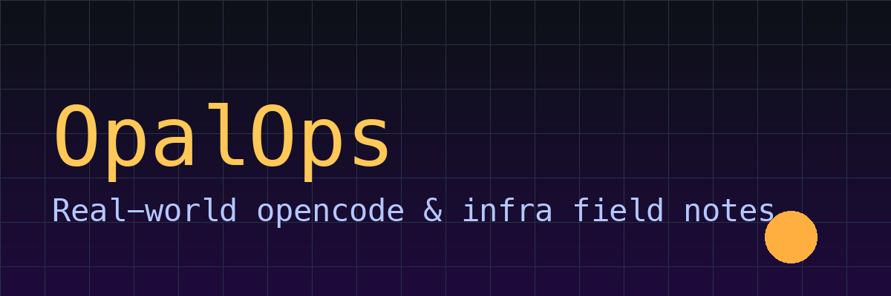

<p align="center">
  
</p>

# OpalOps ⚡

> Hands-on opencode + infrastructure engineering notes — every post is verified on real hardware, ships with code, and is ready to copy-paste.

**🌐 Language:** [中文](README.md) | English


## 📚 Table of Contents

| Article | Topic | Tags |
|---------|-------|------|
| [linux-server-deployment-security-guide.md](linux-server-deployment-security-guide.md) | Complete Linux server deployment & security guide: install → SSH hardening → firewall → systemd → monitoring | `linux` `server` `security` |
| [github-git-gh-cli-complete-guide.md](github-git-gh-cli-complete-guide.md) | GitHub from zero to production: the three core Git concepts + branching/merging + full gh CLI walkthrough | `github` `git` `gh-cli` |
| [macos-terminal-commands-guide.md](macos-terminal-commands-guide.md) | macOS terminal command reference: 100+ everyday commands for absolute beginners across nine categories | `macos` `terminal` `zsh` |
| [macbook-air-m1-8gb-optimization.md](macbook-air-m1-8gb-optimization.md) | Complete MacBook Air M1 8GB optimization guide (disk / memory / background processes / dev environment) | `macos` `optimization` `m1` |
| [raspberry-pi-homelab-guide.md](raspberry-pi-homelab-guide.md) | Raspberry Pi home server fleet: from zero to managing multiple Pi units | `raspberry-pi` `homelab` `linux` |
| [remote-control-mac-via-wechat.md](remote-control-mac-via-wechat.md) | Control your computer from your phone: complete WeChat × AI-assistant bridge tutorial | `wechat` `remote` `automation` |
| [opencode-performance-tuning.md](opencode-performance-tuning.md) | opencode performance tuning: 1.8GB cache → faster responses | `opencode` `sqlite` `performance` |
| [github-cli-device-flow-automation.md](github-cli-device-flow-automation.md) | Automating GitHub CLI Device Flow login with AppleScript | `github` `automation` `osascript` |
| [cc-connect-weixin-dns-troubleshooting.md](cc-connect-weixin-dns-troubleshooting.md) | Debugging cc-connect WeChat bridge "messages not received" — real-world intermittent DNS failure | `weixin` `dns` `troubleshooting` |

> **Note:** The articles themselves are written in Chinese. This repo is a personal engineering notebook — translations of each article may be added over time.

## ✨ Highlights

- ✅ **Verified on real hardware** — every post was run in a real environment, with before/after data
- ✅ **Ships with code** — commands and scripts ready to copy
- ✅ **No fluff** — one concrete problem per post, straight to the point
- ✅ **Pitfall log** — every "trap" is documented so you don't have to step in it

## 🚀 Quick Start

```bash
git clone https://github.com/cwchon310/opalops.git
cd opalops
# pick an article and start reading
```

## 📝 How these were written

Every article comes from a real troubleshooting / optimization session, structured as "problem → diagnosis → fix → lesson" so it's easy to share publicly.

## 🤝 Contributing

Want to add a post? PRs welcome! Format:

```markdown
# Title
> one-line summary
## Problem / ## Diagnosis / ## Fix / ## Lesson
```

## 📄 License

MIT — free to use, modify, and redistribute.